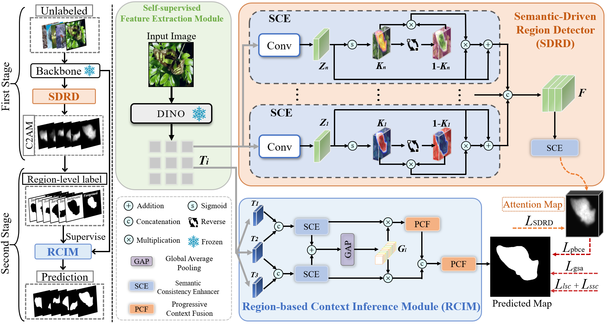

# SAPNet
Self-Anchored Progressive Framework with Noise Mitigation for Unsupervised Camouflaged Object Detection
<p align="center">
  
</p>
# Usage
This code was implemented with Python 3.9, PyTorch 2.4.1 and CUDA 12.4 on an NVIDIA GeForce GTX 3090.
# 1. Dataset Preparation
To train and evaluate the model, you need to download publicly available [datasets](https://drive.google.com/file/d/18b3YG-HTW3da1_NLxyE2dL5LUS1nmc6Y/view?usp=sharing).

After downloading, please organize the dataset as follows:
```bash
COD10K/
├── images/
├── segmentations/
└── tokens/ # This folder will be created in Step 2
```
# 2. Extract DINO Tokens
Before training the model, you need to extract DINO token features from the images.

Clone the Tokencut project
```bash
git clone https://github.com/YangtaoWANG95/TokenCut
```

Then, copy our provided extract_dino_tokens.py into this directory.

Run the following script to extract the features:
```bash
python extract_dino_tokens.py --input_dir <path_to_dataset> --output_dir <path_to_save_features>
```
# 3. Training the Model
After dataset preparation and token extraction, start training with:
```bash
python train.py
```
# 4. Evaluating the Model
To generate prediction maps:
```bash
python test.py
```
To compute evaluation metrics:
```bash
python eval.py
```
# Results
You can view the [results](https://drive.google.com/file/d/1xe4CqAR_7c0RB-HS5LtE82AdTxRNdhV3/view?usp=sharing) of our model on four benchmark datasets.

# Our Bib:
Thanks for citing our work:

# Contact
Please drop me an email for further problems or discussion: liu081824@gmail.com
